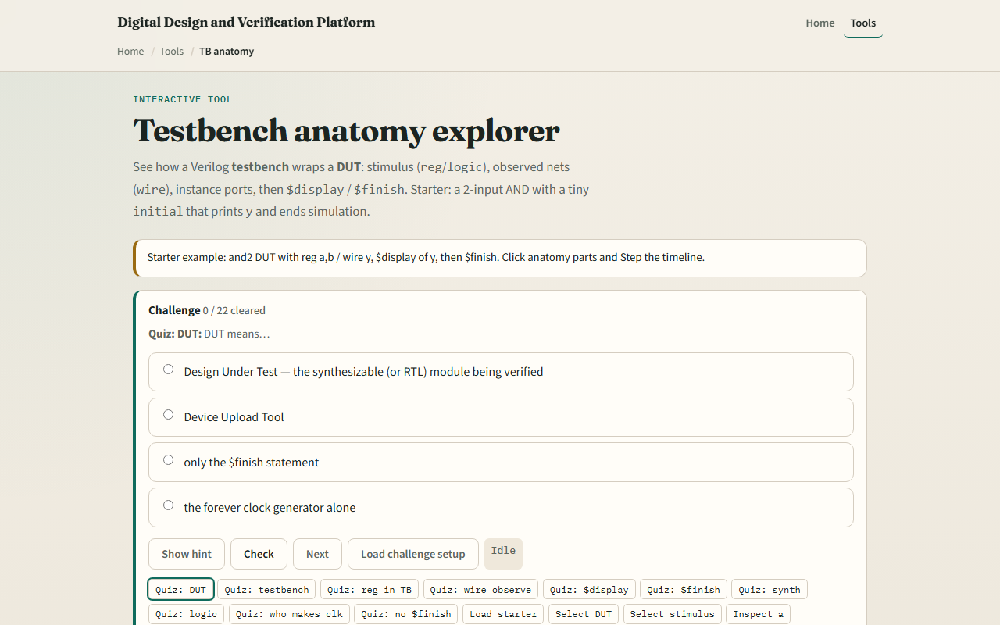

# Module 01 — TB anatomy

**Module id:** module01-tb-anatomy
**Lab:** tb-anatomy
**Tracks:** A (local SV TB) · B (browser lab)

## Slide 1 — TB anatomy

A SystemVerilog testbench is a simulation-only wrapper around a design under test. The TB drives inputs, instantiates the DUT, observes outputs, and ends the run. Classic pieces: stimulus nets you assign in initial or always blocks, a DUT instance with port connections, observation nets the DUT drives, and procedural code that steps time with delays, prints with display, and stops with finish. This module names those regions so later patterns have a map.

## Slide 2 — Classic AND testbench sketch

Starter picture: a tiny AND gate DUT with inputs a and b and output y. In the TB, a and b are regs—you procedural-assign them in initial. y is a wire—the DUT drives it; the TB reads it but does not assign it. The instance wires ports: dut dot a to a, dut dot b to b, dut dot y to y. An initial block applies vectors with hash delays, display the result, then finish. Step the timeline and you see stimulus, propagation, print, and end-of-sim in order.

## Slide 3 — Browser lab

In the browser lab track, open the TB anatomy lab and load the classic AND starter. Click regions—module tb, stimulus, observe, DUT instance, initial block—and watch the code highlight. Step the timeline to see a and b change, y follow, display fire, and finish end the run. Try the wire-stimulus mistake preset to see why you cannot procedural-assign a wire. Use the challenge panel to name reg versus wire roles and where finish belongs.

## Slide 4 — Real SV TB track practice

In the real track, open this module's examples prompts. Restate TB anatomy in one sentence—wrapper, stimulus, DUT, observe, finish. Sketch the AND testbench on paper: label reg a and b, wire y, the instance line, and one initial with two stimulus changes plus display. Optional: map the same regions to a cocotb or Verilator test you already have. No full compile required yet—the goal is to recognize the skeleton in real code.

## Slide 5 — Pitfalls to watch

Do not procedural-assign a wire in initial—that is a classic compile or runtime mistake; use reg or logic for TB-driven inputs. Do not drive a DUT output from the TB—the observation net is read-only from the testbench side. Do not confuse the DUT module with the TB module—only the wrapper is simulation-only. And remember: the browser sketch is conceptual timing; real simulators still need timescale, proper port directions, and tool-specific flags.

## Slide 6 — Your turn

Complete the checklist for at least one track—preferably both. In the browser, load starter, step through display and finish, and clear a couple of anatomy challenges. On paper, draw one TB block diagram with stimulus, DUT, and observe labeled. When you are ready, take the short quiz, then continue to self-checking testbenches.
