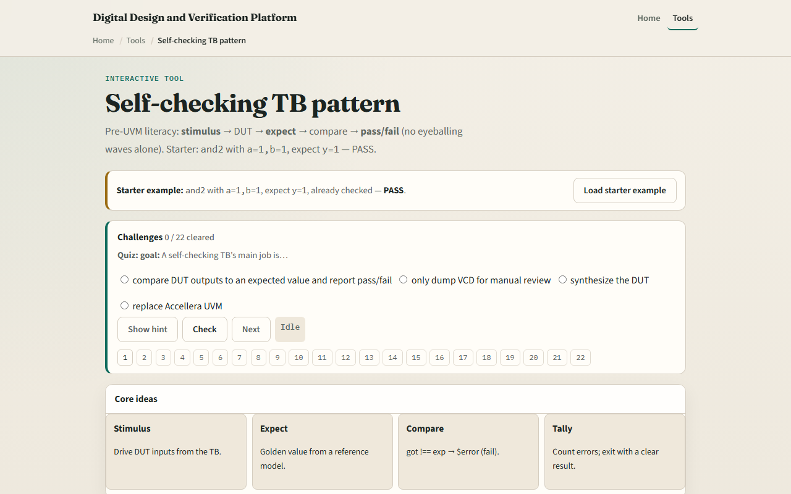

# Self-checking TB

A self-checking testbench compares what the DUT produced against an expected value you computed separately

---

## Golden expect, not copied output
- Starter: AND gate with a equals one and b equals one, expect y equals one
- The expect comes from a model
- After hash one, if y does not equal expect, error with a message; else display pass
- Swap to an adder or mux preset to see wider buses and intentional fail when expect is
- Checking means an independent reference, even if it is just a one-line function in initial

---

## Browser lab

---

## Real SV TB track practice
- In the real track, open this module's examples prompts
- Restate self-checking in one sentence, stimulus, golden expect, compare, pass or fail
- Sketch a tiny initial block on paper
- Optional: name one check you would add to an existing testbench file
- No simulator required yet, recognize the pattern when you see it in code

---

## Pitfalls to watch
- Do not set expect equal to the DUT output you just sampled, that checks nothing
- Do not rely on waves alone for sign-off, automation needs explicit compare and error tally
- Do not forget the delay before sample, combinational paths need time to settle
- Wrong expect on purpose is good practice, you should see fail and error, not a silent pass
- And remember

---

## Your turn
- Complete the checklist for at least one track, preferably both
- In the browser, load starter, run pass, then force a wrong expect and see fail
- Write one if-not-equal error else display pass block with inputs and expect labeled
- When you are ready, take the short quiz, then continue to clock and reset patterns

