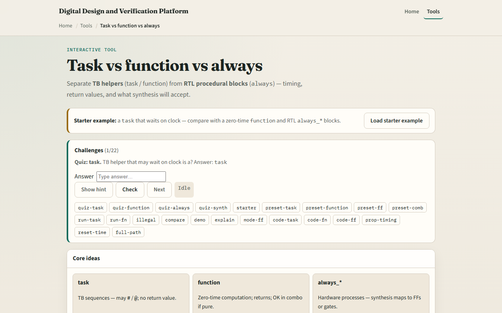

# Module 04 — Task vs function

**Module id:** module04-task-vs-function
**Lab:** task-vs-function
**Tracks:** A (local / offline) · B (browser lab)

## Slide 1 — Task vs function

SystemVerilog gives you several procedural shapes, and they are not interchangeable. A task is a testbench helper that may consume simulation time — it can wait on a clock edge or a delay. A function is zero-time: it returns a value and cannot block. Always blocks live in RTL — always_ff for sequential logic, always_comb for combinational. This module is literacy for picking the right shape, not a full UVM environment yet.

## Slide 2 — Timing, return, and synthesis

Here is the decision table in plain language. Tasks may use hash-delay and at-events; they do not return a value the way functions do — they drive signals or pass outputs through arguments. Functions must finish in zero simulation time and return a value; they are fine inside combinational always blocks when the logic is pure. Always_ff and always_comb are for synthesizable RTL — flip-flops and gates — not for ad-hoc testbench sequencing. The browser lab lets you flip between modes and see timing and synthesis roles side by side.

## Slide 3 — Browser lab



In the browser lab track, open the task-versus-function explorer from the tools page. Load the starter example and pick a mode — task, function, always_ff, or always_comb. Read the source panel and the role legend: timing yes or no, returns a value or not, synthesizable or simulation-only. Step the timeline for a task and watch simulation time advance; switch to function and see zero-time return. Work a few challenges on illegal timing inside functions, then use Check.

## Slide 4 — Real SystemVerilog practice

In the real SystemVerilog track, open this module's examples prompts. Restate the core idea in one sentence — when you need to wait, use a task; when you need a computed value with no delay, use a function; when you build hardware, use always blocks. Sketch the four shapes on paper using the patterns below. Optional stretch: mark which lines would fail synthesis if you moved them into RTL.

```systemverilog
// task — may wait; drives pins over time
task automatic drive_bit(input bit b);
  @(posedge clk);
  din <= b;
endtask

// function — zero time; returns a value
function automatic logic [7:0] add8(input logic [7:0] a, b);
  return a + b;
endfunction

// always_ff — sequential RTL (flip-flops)
always_ff @(posedge clk) q <= d;

// always_comb — combinational RTL
always_comb y = a & b;
```

## Slide 5 — Pitfalls to watch

Do not put hash-delay or at-events inside a function — that is illegal and simulators will reject it. Do not use a task where you only need a pure calculation — functions are clearer and synthesizable when the logic is combinational. Do not confuse always_ff with a task — always_ff describes hardware that updates on clock edges; tasks describe testbench procedures. And remember: the browser sketch is conceptual; real toolchains still need proper module boundaries and timing checks.

## Slide 6 — Your turn

Complete the checklist for at least one track — preferably both. In the browser, load starter, compare task versus function timing, and clear a couple of quiz challenges. On paper, write one task that waits two clock edges and one function that adds two bytes with no delay. When you are ready, take the short quiz, then continue to fork and join in the next module.
