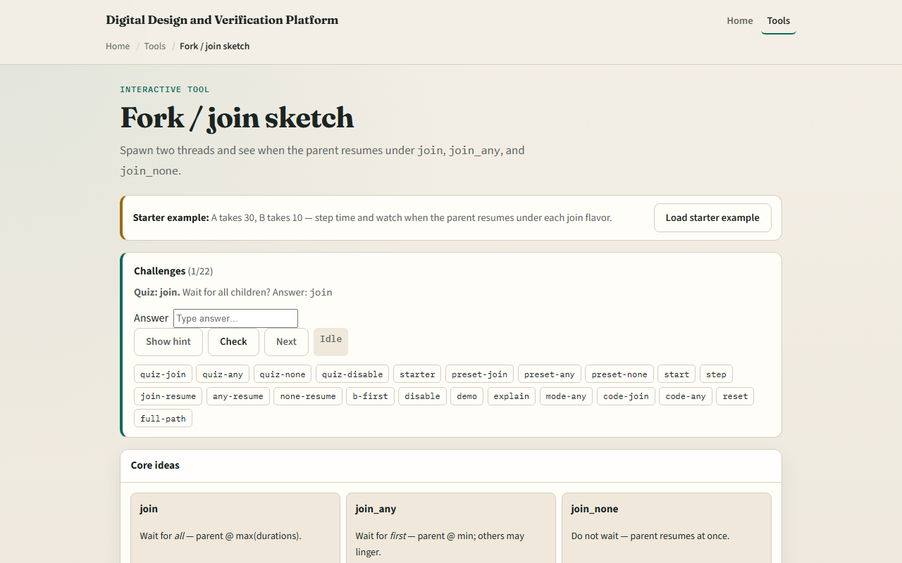

# Module 05 — Fork / join

**Module id:** module05-fork-join
**Lab:** fork-join
**Tracks:** A (local / offline) · B (browser lab)

## Slide 1 — Fork / join

When a testbench needs parallel activity — two stimulus threads, a monitor and a driver, or a timeout watchdog — you fork separate threads and then choose how the parent waits. Join waits until every child finishes. Join_any waits until the first child finishes; the others may keep running. Join_none does not wait at all — the parent continues immediately while children run in the background. This module is literacy for that timeline, not a full multi-agent UVM test yet.

## Slide 2 — When the parent resumes

Picture two forked threads: A takes thirty time units, B takes ten. Under join, the parent resumes at thirty — the maximum. Under join_any, the parent resumes at ten — the minimum — and you must decide what to do with the slower thread still running. Under join_none, the parent resumes at zero while both children continue. That difference drives real testbench structure: join for clean shutdown, join_any for racing alternatives, join_none for fire-and-forget background monitors.

## Slide 3 — Browser lab



In the browser lab track, open the fork-and-join sketch from the tools page. Load the starter example with A at thirty and B at ten. Step simulation time and watch the parent state under join — it should stay waiting until both threads finish. Switch to join_any and see the parent resume when B completes first. Try join_none and confirm the parent moves on immediately. Use the challenge panel to predict resume times, then Check your answers.

## Slide 4 — Real SystemVerilog practice

In the real SystemVerilog track, open this module's examples prompts. Restate when you would pick each join flavor — all done, first done, or no wait. Sketch the fork block below on paper and write the resume time for each keyword with A equals thirty and B equals ten. Optional stretch: note what happens to the slower thread after join_any if you disable fork.

```systemverilog
// fork-join — parent waits for ALL children (max time)
fork
 begin #30; $display("A done"); end
 begin #10; $display("B done"); end
join
$display("parent resumes"); // at t=30 under join

// join_any — parent resumes at FIRST finish (min time)
// join_none — parent resumes immediately (t=0)
```

## Slide 5 — Pitfalls to watch

Do not assume join_any stops the other threads — they may still run unless you explicitly disable them. Do not use join_none when the parent must observe child results before continuing — you need join or a handshake. Do not forget that resume time depends on the slowest or fastest child, not an average. And remember: the browser timeline is a sketch; real simulators still need proper variable scope and race-free communication between threads.

## Slide 6 — Your turn

Complete the checklist for at least one track — preferably both. In the browser, load starter, step through join and join_any, and state the parent resume time for each. On paper, write a fork block with two delays and label where the parent prints under all three join keywords. When you are ready, take the short quiz, then continue to file and vector I/O in the next module.
