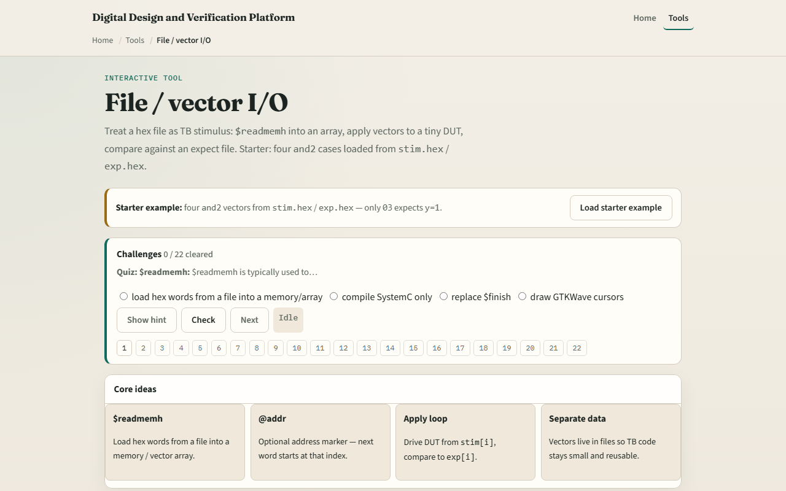

# File / vector I/O

Regression stimulus often lives outside the testbench source

---

## Stimulus, expect, and apply loop
- The usual shape is three arrays: stimulus, expected, and optionally actual results
- Dollar-readmemh loads hexadecimal words line by line
- A for loop walks from zero to N minus one
- The same loop handles four vectors or four thousand

---

## Browser lab


---

## Real SystemVerilog practice
- In the real SystemVerilog track, open this module's examples prompts
- Restate the apply-loop idea in one sentence , load hex files, drive, compare
- Sketch the pattern below on paper and label what each array holds
- Optional stretch
- ```systemverilog // Load vectors from hex files at time zero reg [7:0] stim [0:DEPTH-1]

---

## Pitfalls to watch
- Do not mix up dollar-readmemh and dollar-readmemb
- Do not forget at-address when your files have gaps or comments
- Do not compare before inputs have settled
- And remember

---

## Your turn
- Complete the checklist for at least one track , preferably both
- In the browser, load the starter and-two set, run Apply all
- On paper, write two hex lines for stim and two for exp that test an or-two
- When you are ready

