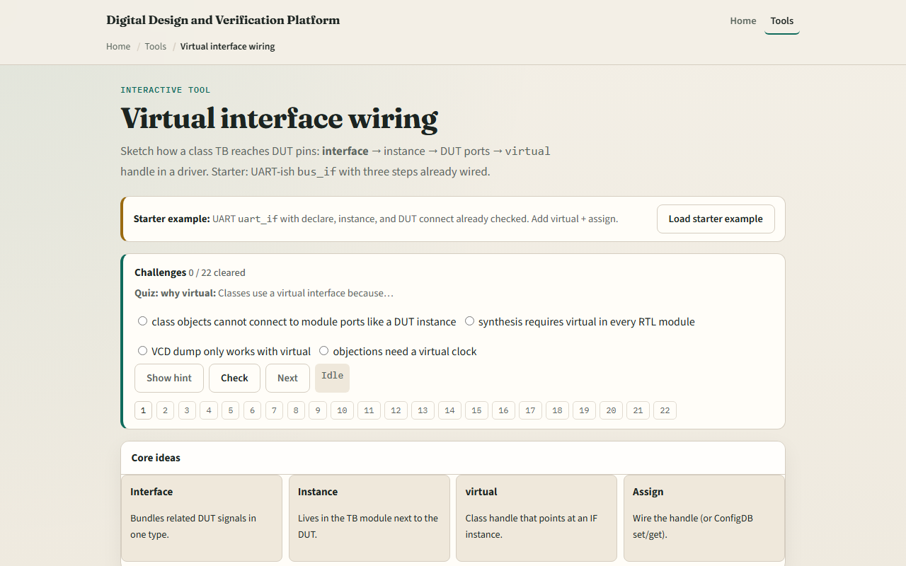

# Module 07 — Virtual interface wiring

**Module id:** module07-vif-wiring
**Lab:** vif-wiring
**Tracks:** A (local / offline) · B (browser lab)

## Slide 1 — Virtual interface wiring

Class-based testbenches need a bridge to the DUT pins — you cannot pass module ports into a class the way you pass integers. A SystemVerilog interface bundles signals and modports; a virtual interface is a class-side handle that points at a concrete interface instance in the testbench module. Wire the DUT to the interface, instantiate the interface in tb, assign the virtual handle in the class, then drive and sample through vif dot signal. This module is literacy for that wiring chain, not a full UVM config database flow yet.

## Slide 2 — The wiring checklist

Six steps, in order. Declare the interface with clock and bus signals. Instantiate it in the testbench module with clock connected. Connect DUT ports to interface signals or a modport. Declare a virtual interface handle inside the driver or monitor class. Assign the handle — drv dot vif equals bif, or later a config database set and get. Drive and sample through the handle — vif dot tx, at posedge vif dot clk. Skip a step and the class never sees real pins; get the order wrong and elaboration fails before simulation starts.

## Slide 3 — Browser lab



In the browser lab track, open the virtual-interface wiring lab from the tools page. Load the UART starter with declare, instance, and DUT already checked. Step through the remaining checklist items — virtual handle, assign, drive — and watch the code panel grow. Toggle each step and confirm which lines appear or disappear. Try the SPI preset to see the same pattern on a different bus. Work the challenges on modports and handles, then use Check.

## Slide 4 — Real SystemVerilog practice

In the real SystemVerilog track, open this module's examples prompts. Restate the wiring chain in one sentence — interface instance in tb, virtual handle in class, assign before drive. Sketch the UART pattern below on paper and number the six checklist steps next to each block. Optional stretch: note where a UVM config database call would replace the direct assign in a larger environment.

```systemverilog
// 1–2: declare + instantiate in tb
interface uart_if(input logic clk);
  logic tx, rx;
endinterface
module tb;
  logic clk;
  uart_if bif(.clk(clk));
  uart_tx dut(.clk(bif.clk), .tx(bif.tx));

// 3–4: virtual handle in class
class uart_driver;
  virtual uart_if vif;
  task drive_bit(bit v);
    @(posedge vif.clk);
    vif.tx <= v;
  endtask
endclass

// 5: assign handle before use
// drv.vif = bif;
```

## Slide 5 — Pitfalls to watch

Do not drive DUT ports directly from a class when an interface is the intended boundary — you lose modport discipline and reuse. Do not forget to assign the virtual handle before calling drive tasks — null handles fail at runtime. Do not mix up virtual interface with a plain interface instance — only the virtual keyword goes inside the class. And remember: the browser sketch stops at direct assign; production UVM still uses config database patterns you will meet later.

## Slide 6 — Your turn

Complete the checklist for at least one track — preferably both. In the browser, load the UART starter, check all six wiring steps, and explain what breaks if you skip assign. On paper, draw the signal path from class through virtual handle to DUT pin. When you are ready, take the short quiz, then continue to class and inheritance sketch in the next module.
