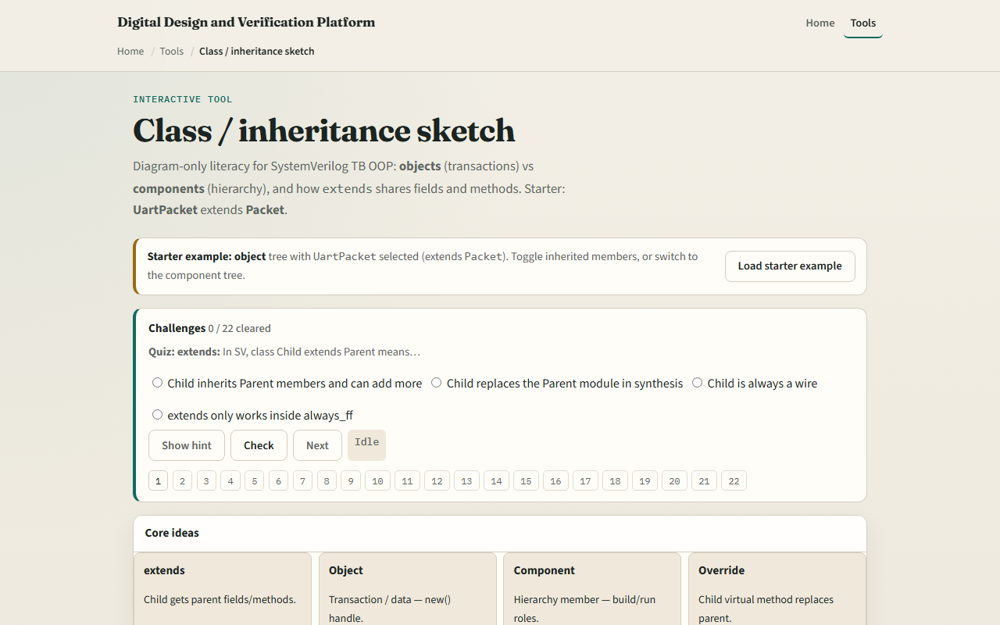

# Class / inheritance sketch

SystemVerilog testbenches lean on classes long before UVM

---

## Objects versus components
- On the object side, a base class carries a name
- Siblings like SpiPacket share the same parent but different extras
- On the component side, CompBase knows parent and name
- Objects are data handles you create and pass
- Extends means the child inherits every member unless it overrides a virtual method

---

## Browser lab

---

## Real SV TB track practice
- In the real track, open this module's examples prompts
- Restate the two trees in one sentence, objects for data, components for hierarchy
- On paper, sketch Packet with two children
- Then sketch CompBase with Driver and Monitor as siblings and UartDriver extending Driver
- Optional: find one extends in a local testbench or UVM example and label parent and child
- No compile required, the goal is to read inheritance, not run a full class runtime

---

## Pitfalls to watch
- Do not treat every class as a component
- Do not copy fields into every child when extends already shares them
- Do not forget virtual when you mean override
- And remember

---

## Your turn
- Complete the checklist for at least one track, preferably both
- In the browser
- On paper, draw one object tree and one component tree with extends arrows labeled
- When you are ready

