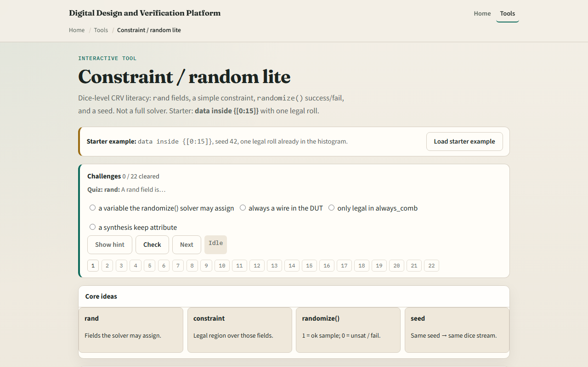

# Constraint / random lite

Constrained random verification picks legal values automatically instead of hand-writing every vector

---

## Rand, constraints, randomize
- A rand field tells the tool this value may change on each randomize call
- A constraint block filters the domain
- Randomize returns success when at least one legal combination exists
- The legal set here is small and discrete
- Fix a seed before you roll so two runs with the same seed produce the same sample sequence

---

## Browser lab

---

## Real SV TB track practice
- In the real track, open this module's examples prompts
- Restate CRV lite in one sentence, rand fields, constraints, randomize, seed
- On paper, write a tiny class with one rand byte and constraint data inside zero through
- Predict randomize success or failure before you check
- Optional: run randomize in a local simulator if you have one

---

## Pitfalls to watch
- Do not assume randomize always succeeds, over-constraining is a real bug source
- Do not forget the seed when you want reproducibility
- Do not treat inside as the only constraint form, modulo, inequalities
- And remember

---

## Your turn
- Complete the checklist for at least one track, preferably both
- In the browser
- On paper, write one solvable constraint and one impossible pair
- When you are ready

