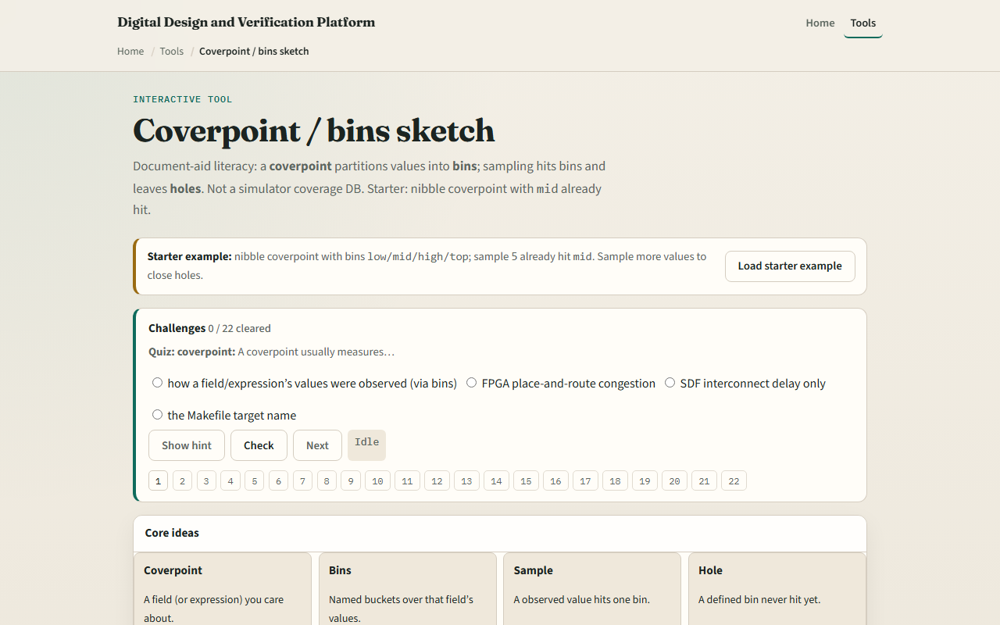

# Module 10 — Coverpoint / bins

**Module id:** module10-cover-bins
**Lab:** cover-bins
**Tracks:** A (local SV TB) · B (browser lab)

## Slide 1 — Coverpoint / bins

Functional coverage asks whether you exercised interesting values—not just whether the test passed. A coverpoint watches a field; bins partition that field into named buckets. Each sample increments hit counts for matching bins; bins with zero hits are holes you may still need to stimulate. This module is document-aid literacy: a nibble coverpoint with low, mid, high, and top bins—not a simulator coverage database, but the same closure vocabulary you will see in plans and reviews.

## Slide 2 — Coverpoints, bins, holes

A covergroup wraps one or more coverpoints. Each coverpoint names a signal or slice—here data three colon zero, the low four bits. Bins group values: low covers zero through three, mid covers four through seven, and so on. When you sample a value, every bin that contains it gets a hit. A hole is a defined bin with zero hits after your tests—meaning you never drove that region. Coverage percent is roughly bins hit divided by bins defined, though real projects weight bins and add crosses; this lab stays with single coverpoints.

## Slide 3 — Browser lab

In the browser lab track, open the cover bins lab and load the nibble starter—the mid bin already has one hit from sample five. Read the four bins and their value ranges. Sample a few new values and watch hit counts move. Deliberately leave low and top at zero and see holes highlighted. Try the opcode preset with one value per named bin, then the FIFO level preset where one value sits outside every bin—that shows a modeling gap, not just a missing stimulus. Work a challenge that names which bin a sample hits, then use Check.

## Slide 4 — Real SV TB track practice

In the real track, open this module's examples prompts. Restate coverpoint literacy in one sentence—partition a field into bins, sample to hit, holes mean missing stimulus. On paper, write a coverpoint on a two-bit opcode with idle, read, write, and err bins—one value each. List three sample sequences and mark which bins each sequence hits. Sketch one hole you would close by adding a directed test. Optional: map the same bin names to a coverage section in a verification plan you have seen.

## Slide 5 — Pitfalls to watch

Do not confuse a hole with an ignorable value—if a value is not in any bin, that is a modeling gap, not just low coverage. Do not assume one hundred percent bin hit means done—cross coverage and weighted goals matter in real closure. Do not sample randomly without a plan—directed tests often fill stubborn holes faster than hope. And remember: this browser sketch counts hits in memory; your simulator writes a coverage database with merge and reporting tools.

## Slide 6 — Your turn

Complete the checklist for at least one track—preferably both. In the browser, sample until low and top both have hits, then state how many bins were holes at the start. On paper, write one coverpoint with four bins and mark which bin value seven hits. When you are ready, take the short quiz, then continue to SVA implication timeline in the next module.
