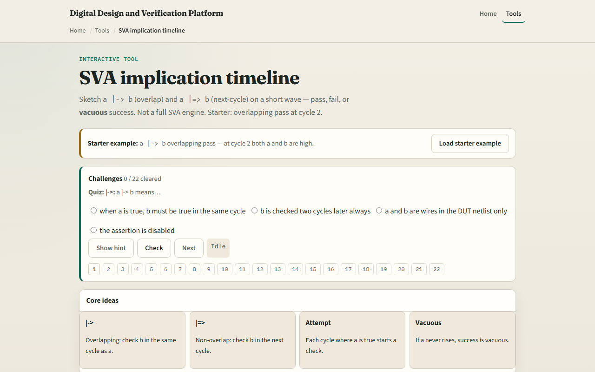

# SVA implication timeline

You have built directed testbenches, classes, constraints, and coverpoints

---

## Overlap, next cycle, and vacuous
- Here is the starter picture
- Antecedent a and consequent b both high at cycle two under overlapping implication
- Shift b one cycle later and overlapping fails while non-overlapping can pass
- If a never goes high
- The lab presets walk overlap pass, overlap fail, next-cycle pass, next-cycle fail
- Rebuild after you change operator or waves so the verdict panel updates before you trust

---

## Browser lab

---

## Real shell practice
- In the real shell track, open this module's examples prompts
- Restate the timeline idea in one sentence
- Sketch one worked example on paper
- Optional stretch
- No full simulator run required yet, the goal is to read SVA timing in your head

---

## Pitfalls to watch
- Do not treat overlapping and next-cycle operators as interchangeable
- Do not celebrate vacuous green as a design win
- Do not confuse this sketch with full SVA sequences and repetitions
- And remember

---

## Your turn
- Complete the checklist for at least one track, preferably both
- In the browser, load starter, run the overlap pass and vacuous presets
- On paper, draw one eight-cycle wave and mark where each operator would pass or fail
- When you are ready, take the short quiz, then continue to the testbench versus UVM map

