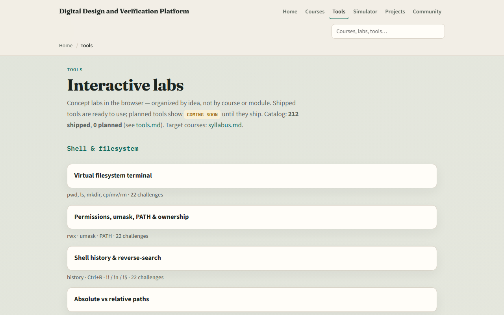

# SV TB complete

The map to UVM roles

---

## What you can do now
- You can sketch a directed testbench with stimulus, observation, and self-check
- You know when a task beats a function, how fork-join shapes parallel activity
- Point at the UVM block that would replace a flat initial block
- That is SV testbench literacy

---

## Close the track gaps
- If you leaned on browser labs
- If you leaned on offline only, reopen one visual lab you avoided
- Both tracks together beat either alone: sketches for speed, simulators for fidelity
- Choose one weak skill, spend ten minutes

---

## Tools shelf for review
- The learning platform tools index lists every SV testbench sketch you touched
- You do not need to re-clear every challenge; use the shelf as a spaced-review map
- Open one lab you would not want to explain in a stand-up and spend ten minutes until you
- That beats racing forward with fuzzy memory of what a cover hole means

---

## Where to go next
- Scoreboards, you already mapped the roles
- Learn formal fits if you want properties, vacuity
- Learn cocotb is an alternative Python-first bench path
- The syllabus learning ladder shows how these courses connect

---

## Your turn
- Complete the wrap checklist honestly
- Take the short quiz for this module
- Name what you check, show your waves, and question passes you cannot narrate

